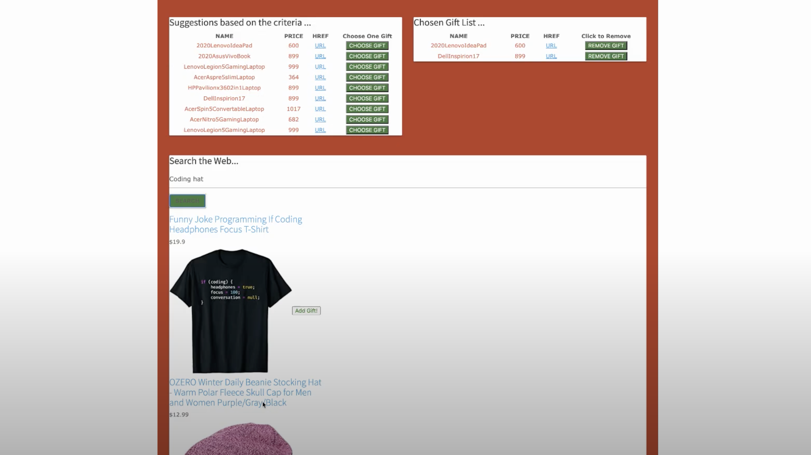

# Santa's Bag

## Description
   This app will ease your gifts shopping process during the holiday season. You can add all your loved ones and specify a budget for each one and the app will help you find the right gift/s along with managing your overall budget.  
   
## Table of Contents:
  * [Demo Login](#Demo_Login)
  * [Links](#Links)
  * [Techs](#Techs)
  * [Installation](#Installation)
  * [Usage](#usage)
  * [Contributions](#contributions)
  
   
## Demo_Login
   username: samers88@gmail.com  
   password: 12345678  

## Links  
- [Heroku Deployed App](https://santas-bag.herokuapp.com/)  
- [Watch a Demo](https://www.youtube.com/watch?v=anhtoBlPbDM)  

## Techs
  MySQL, Node.JS, JS, jQuery, Bootstrap and materialize, CSS, Sequelize, Express, Passport, Bcryptjs, Dotenv, [Amazon Product/Reviews/Keywords API](https://rapidapi.com/logicbuilder/api/amazon-product-reviews-keywords/).

## Installation
  To run the app on your local computer you'll need to have MySQL installed. Download the project -> run npm i -> create .env file to setup your local db connection variables || use config.json to set up your local connection to MySQL -> in terminal run: npm start. 
  
## Usage
  First, create your account using the SignUp screen.  
  Then, you can start adding to your circle of loved ones.   
  Each person you add should have a budget for gifts and interest, the app will use that info to generate suggestions of gifts.  
  Add some gifts to each person using the suggestions or direct search using our API.  
  The total expenses is display in a small red box and total expenses for each person is saved as well.  
  You can try the app on heroku here: [Heroku Deployed App](https://santas-bag.herokuapp.com/).  
  [Watch a Demo](https://www.youtube.com/watch?v=anhtoBlPbDM)  
  
## Screenshots
  
  
  
  
  
## Contributions
  The team behind this app:
  * [Meena Ambalam](https://github.com/meenaambalam)
  * [Jeff Thao](https://github.com/JeffThao)
  * [Ravi Knutson](https://github.com/Knuts839)
  * [Samer Saadoun](https://github.com/samergain)  
  
